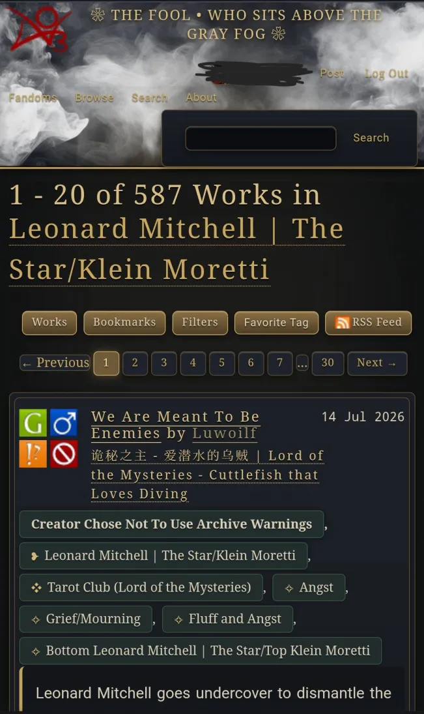
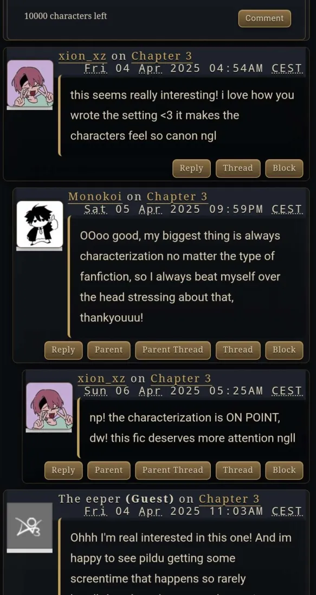
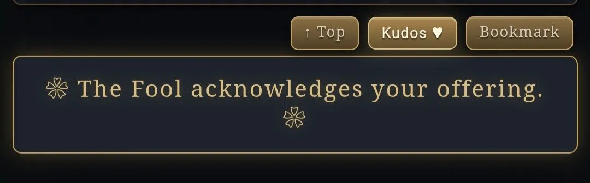
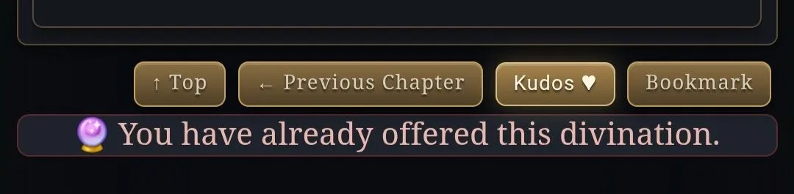
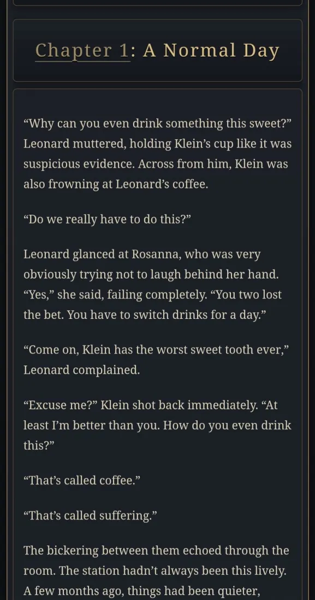
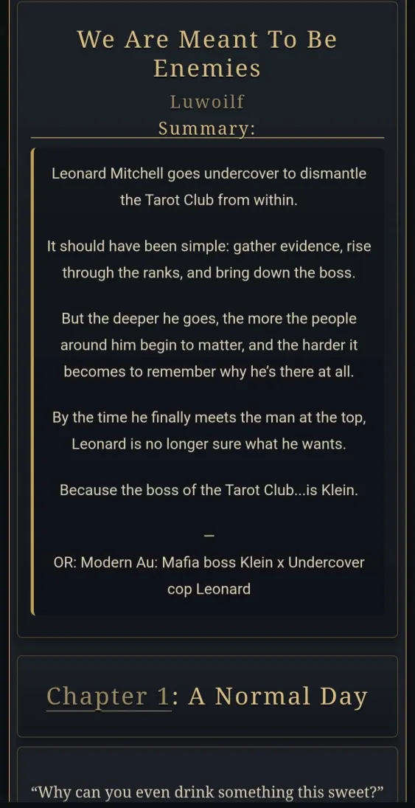

# LOTM AO3 Skin — The Fool

## Overview

## How to install

Log in to AO3 and go to **My Preferences → Skins** (or **Work Skins** if you want it to apply only to a specific work). Click **Create Skin**. Give it a unique title (e.g. "LOTM — The Fool"). Paste the entire contents of CSS into the CSS field.

## What's in the file:

- **`:root` variables** — all colors are defined once at the top (`--lotm-bg`, `--lotm-gold`, `--lotm-paper`, etc.) and reused everywhere else. Change a color here and it updates across the whole skin.
- Global layout & body background
- Header (including the "THE FOOL..." banner text and fog overlay)
- Links
- Panels/cards (blurbs, works, comments, bookmarks, fieldsets)
- Headings
- Buttons/actions
- Form fields
- Tags (fandom/relationship/character/freeform pills + icons)
- Comment threads (including the byline/header bar)
- Notices & errors (including custom kudos messages)
- Stats block (with decorative icons before word count, hits, etc.)
- Pagination
- Footer
- Scrollbar & text selection
- Horizontal rules
- Work/chapter body text & blockquotes
- Preface

## Screenshots

### Comment Section

### Kudos

### Kudos already used

### Mobile view

### Author's Notes

